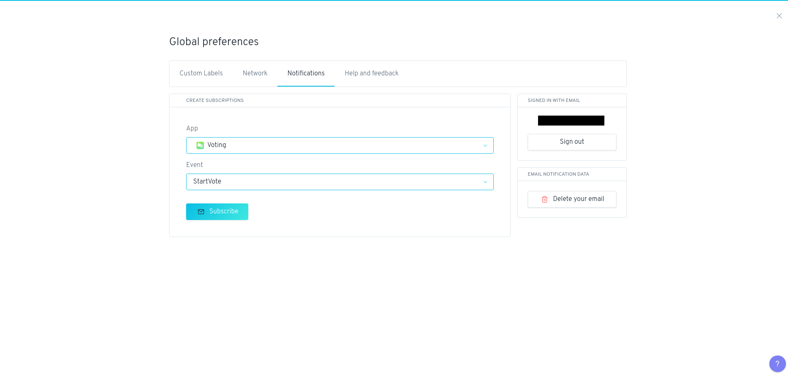

# Inicio


En esta sección, exploramos la página de inicio de su DAO, el menú y la sección principal.


## Página de inicio

La **página de inicio** le da la bienvenida a su organización y le ofrece varias opciones para diferentes acciones que puede realizar.

### La página de inicio es una simple página de aterrizaje que le muestra:

* El **nombre de la organización** (en la parte superior izquierda) que ha creado y cargado.&#x20;
* La **dirección del monedero** y la **network (red)** en uso (en la parte superior derecha).&#x20;
* Así como diferentes acciones que puedes llevar a cabo utilizando las **apps preinstaladas** en su organización.

Usted también puede utilizar el menú de la izquierda de la pantalla para ver las diferentes **aplicaciones** que están actualmente instaladas para su organización.

En el ejemplo (mostrado en la imagen), la organización _**camino.aragonid.eth**_ tiene instaladas las aplicaciones Token Manager, Voting, Finance y Agent, además de las aplicaciones por defecto Permissions, App Center y Organization System.

Así que en este DAO podemos realizar las acciones de asignar _Tokens_, _votar_, c_omprobar las finanzas_ y crear pagos.

## Características del menú

En el menú de la parte superior izquierda y derecha de la pantalla, hay varias funciones que pueden resultarle útiles.&#x20;

Tenga en cuenta que muchas de estas funciones aprovechan el _almacenamiento local_ de su navegador, por lo que si borra los datos del mismo puedes perderlos a menos que haga una copia de seguridad.

### Indicador de conexión a la red

El indicador de conexión a la red (situado en la parte superior derecha) le dirá si el cliente de Aragon que está utilizando está conectado a una de las redes soportadas o no (ya sea Ethereum, Polygon, Harmony, Rinkeby, etc.).

* <mark style="color:red;">Luz roja</mark>: su Cliente Aragon no está conectado al nodo. La conexión ha fallado.
* <mark style="color:green;">Luz verde</mark>: su Cliente Aragon está bien conectado al nodo y funciona correctamente. El Cliente está conectado con éxito a la red.

### Activar la cuenta


Para utilizar el Cliente Aragon, primero debe permitir que Aragon acceda a su cuenta de Ethereum (su cartera web3).


Esto permitirá al cliente de Aragón enviar transacciones a su cuenta de Ethereum para su firma y leer información sobre su cuenta de Ethereum, como la dirección y los balances de tokens.


Para más información sobre la cuenta de Ethereum y el monedero Metamask de web3 lea [aquí](../../set-up-metamask/).


Si aún no está conectado, haga clic en _**Enable account**_ (Habilitar cuenta) y apruebe la solicitud de acceso en su proveedor de Ethereum para completar el proceso.

### Organización favorita

Puede hacer clic en el nombre de la organización en la parte superior izquierda de la pantalla y hacer clic en el icono de la estrella junto a ella para añadir la organización a sus favoritos.

Entonces, incluso si va a otra organización, puede hacer clic en el **nombre de la organización** y ver su lista de favoritos a la que puedes navegar fácilmente.

### Estado de la actividad

Haga clic en el icono de la _**campana de alarma**_ (a la derecha) para ver el estado de las transacciones que ha realizado usando Aragon.

Puede borrar el historial de estados haciendo clic en el botón _**Clear history** (_Borrar historial) una vez que haya realizado una transacción.

### Preferencia global

Haga clic en el icono **\_gear \_** (engranaje) (en la parte superior derecha) para gestionar sus preferencias globales. Estas preferencias se guardarán localmente y se utilizarán en todas las organizaciones de Aragon que utilice.

## Etiquetas personalizadas

Haz clic en cualquier dirección de Ethereum en todo el Cliente Aragon para darle una etiqueta personalizada, como el nombre de la persona u organización propietaria de la dirección. Introduzca la etiqueta y guárdela.

Estas etiquetas aparecerán entonces en sus preferencias globales (el icono del engranaje en la parte superior derecha) en la pestaña Etiquetas personalizadas. Puede importar una lista de etiquetas proporcionada por otra persona, y también exportar o cualquier etiqueta que haya creado.

Asegúrese de exportar sus etiquetas de vez en cuando para tener una copia de seguridad en caso de que el almacenamiento local de su navegador donde se guardan las etiquetas se borre accidental o intencionadamente.

## Notificaciones

Puede optar por recibir notificaciones por correo electrónico sobre la actividad de las organizaciones que le interesan en la pestaña de notificaciones de sus preferencias globales.&#x20;

Introduzca su dirección de correo electrónico y haga clic en el enlace de activación de su correo electrónico para inscribirse.


Si no recibe el correo electrónico en su carpeta de entrada, compruebe su carpeta de correo no deseado.


A continuación, puede añadir "actions" ("acciones") en su organización de las que desee recibir notificaciones cada vez que ocurran.

## Menú de aplicaciones

En la barra lateral izquierda aparecen todas las aplicaciones instaladas en su DAO. Para acceder a una aplicación haga clic en su nombre. Para más información sobre las aplicaciones vaya [aquí](what-are-apps/).

## Menú del sistema

En la barra lateral izquierda, haga clic en el menú _**System**_ (Sistema) para mostrar la configuración del sistema que viene por defecto con cada plantilla de organización de Aragon:

* Permissions (Permisos)
* App Center (Centro de aplicaciones)
* Organization (Organización)


Para obtener más información sobre los ajustes, vaya [aquí](system-setting/).


> <mark style="color:purple;">**¿Tiene alguna pregunta? Deje sus comentarios aquí en nuestro foro Discourse (disponible actualmente solo en**</mark> <mark style="color:purple;">**inglés).**</mark>** 👇**


